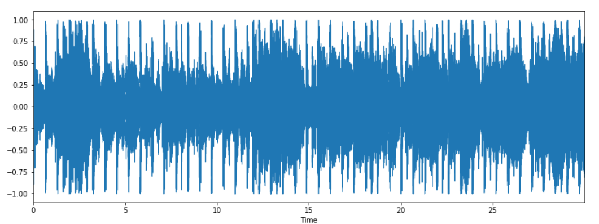

# Automated-Music-Genre-Detection-and-Classification-using-Machine-Learning
## Introduction:
<p align="center"></p>
  <br><div align="justify">A novel method for classification of different genres of music using Python programming language and its tools has been proposed. Two Python libraries are used namely Librosa and Ipython. Audio is visualized as a Spectrogram and an audio signal is created. After that various features are extracted from the audio signals which are relevant to our problem. After extraction of features existing classification algorithms are used to categorize songs in various genres.</div>
  
  <br><h2>Dataset</h2>
  <br><div align="justify">We used <b>GTZAN</b> music/speech collection dataset which is obtained for the purpose of music/talk differentiation. The dataset comprises 120 tracks, each 30 secs in length. Each group (music/speech) has 60 instances. The tracks are 16-bit Mono audio files in <b>.wav</b> format. 
<br>This dataset contains audio from 10 different music genres which are:-
  1. Blues
  2. Country
  3. Classical
  4. Disco
  5. Hip hop
  6. Jazz
  7. Metal
  8. Pop
  9. Reggae
  10. Rock
  
  This dataset is availbale in Kaggle:
  [GTZAN_dataset](https://www.kaggle.com/carlthome/gtzan-genre-collection)
  <br><h2>Convolutional Neural Network</h2>
  <br><p align="center"></p>
  <br><div align="justify">In a standard CNN architecture there are basically multiple convolutional layers after which comes a stack of pooling layers. At the end we obtained a fully connected layer.
  1. <b>Input layer:</b> The convolutional layer is the key construction unit of CNN. In this layer we used 512 nodes. With “RELU” as our activation functions.
  2. <b>Hidden layers:</b> It is the layer where all the computational process occurs and this layers play an important role in the CNN. This is three layered with 256, 128 and 64 nodes respectively. The activation function used here is the “RELU”.
  3. <b>Output layer</b>: This is the final layer of our CNN model. This contains only 10 nodes. And we used “Softmax” as our activation function for this layer. The optimizer used here is the “Adam” optimizer and the “sparse categorical crossentropy” as our loss function.</div>
  <br><h2>LIBROSA</h2>
  <br><div align="justify">Before we start this project we need to know about the LIBROSA dependency. It is a python dependency for assessment of music and audio. It facilitates the building blocks needed for the creation of music information recovery systems. We used LIBROSA for feature extarction.
  1. <b>Audio Player:</b> It is used to play the audio right away in jupyter notebook. It is done in this way:
  ```
  import IPython.display as ipd
  ipd.Audio(audio_path)
  ```
  <br>This returns a toolbar to play and control the sound clip in the jupyter notebook. It looks like:
  <br><p></p>
  2. <b>Wavefrom display:</b> We can track the audio array with the help of ```librosa.display.waveplot```
  <br> The Waveform looks like:
  <br><p></p>
</div>
