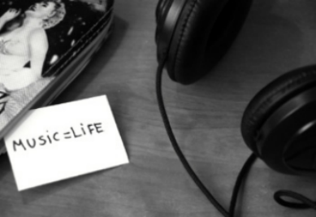

# Automated-Music-Genre-Detection-and-Classification-using-Machine-Learning
## Introduction:

 If you want to read the <b>ABSTRACT</b>, it is given below:
   
The classification of music genres is a key component of the Music Information Retrieval (MIR). There are no clear definitions and boundaries of musical genres because they emerge from the complex interaction of public, marketing, historical and cultural factors. Recently, for the fast growth in the use of digital music, it has received considerable attention. Musical genres are categorical terms for the characterization of human-made musical pieces. The different genres in music are characterized by the unique features that its members share. Typically, these features are related to musical instruments, rhythmic structures and harmonic contents. Audio categorization is important for the management of the music archives, whether it is a professional library or a personal collection. Previous projects in this field has already generated multiple audio features and techniques for classification; however, classification of genres remains an unsolved issue. The musical annotation of the genre is currently performed manually. Automatic musical genre classification can help and eliminate human users in this process and would be a useful addition to the system of Music Genre Classification (MIR). More over, the automated classification of musical genres provides a base for the creation and assessment of features for any form of content-based analysis of musical signals. This issue of classification of music can be different to different individuals, as each user may have its own criteria for classifying music. With automated process results, the user can manually adjust the additional grouped music pieces in the database to the quality classes and/or misclassifications according to his own requirement and preferences. Such a system can massively enhance music streaming and retrieval performance while simultaneously ensuring consistency and satisfaction of users with the results. We dealt with the problem of the scarcity of publicly available music dataset.

  
  ##Dataset
   
We used <b>GTZAN</b> music/speech collection dataset which is obtained for the purpose of music/talk differentiation. The dataset comprises 120 tracks, each 30 secs in length. Each group (music/speech) has 60 instances. The tracks are 16-bit Mono audio files in <b>.wav</b> format. 
 This dataset contains audio from 10 different music genres which are:-
  1. Blues
  2. Country
  3. Classical
  4. Disco
  5. Hip hop
  6. Jazz
  7. Metal
  8. Pop
  9. Reggae
  10. Rock
  
  This dataset is availbale in Kaggle:
  [GTZAN_dataset](https://www.kaggle.com/carlthome/gtzan-genre-collection)
