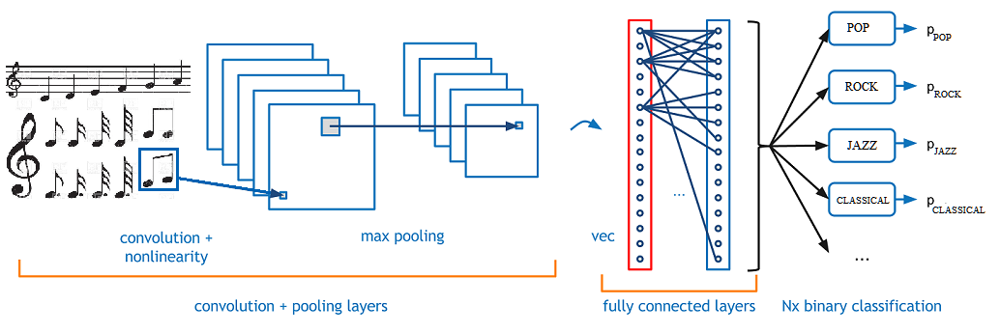

# Automated-Music-Genre-Detection-and-Classification-using-Machine-Learning
## Introduction:

   
A novel method for classification of different genres of music using Python programming language and its tools has been proposed. Two Python libraries are used namely Librosa and Ipython. Audio is visualized as a Spectrogram and an audio signal is created. After that various features are extracted from the audio signals which are relevant to our problem. After extraction of features existing classification algorithms are used to categorize songs in various genres.

  
   <h2>Dataset</h2>
   
We used <b>GTZAN</b> music/speech collection dataset which is obtained for the purpose of music/talk differentiation. The dataset comprises 120 tracks, each 30 secs in length. Each group (music/speech) has 60 instances. The tracks are 16-bit Mono audio files in <b>.wav</b> format. 
 This dataset contains audio from 10 different music genres which are:-
  1. Blues
  2. Country
  3. Classical
  4. Disco
  5. Hip hop
  6. Jazz
  7. Metal
  8. Pop
  9. Reggae
  10. Rock
  
  This dataset is availbale in Kaggle:
  [GTZAN_dataset](https://www.kaggle.com/carlthome/gtzan-genre-collection)
   <h2>Convolutional Neural Network</h2>
   

   
In a standard CNN architecture there are basically multiple convolutional layers after which comes a stack of pooling layers. At the end we obtained a fully connected layer.

