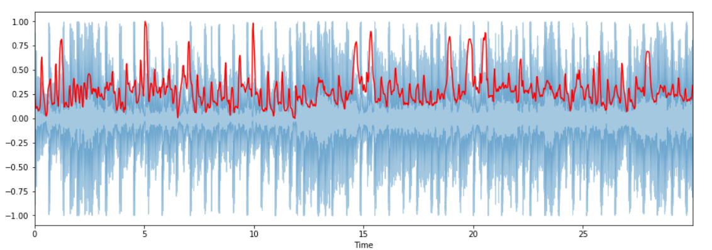
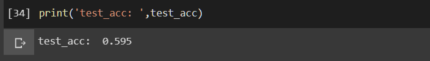

# Automated-Music-Genre-Detection-and-Classification-using-Machine-Learning
## Introduction:
<p align="center"></p>
  <br><div align="justify">A novel method for classification of different genres of music using Python programming language and its tools has been proposed. Two Python libraries are used namely Librosa and Ipython. Audio is visualized as a Spectrogram and an audio signal is created. After that various features are extracted from the audio signals which are relevant to our problem. After extraction of features existing classification algorithms are used to categorize songs in various genres.</div>
  
  <br><h2>Dataset</h2>
  <br><div align="justify">We used <b>GTZAN</b> music/speech collection dataset which is obtained for the purpose of music/talk differentiation. The dataset comprises 120 tracks, each 30 secs in length. Each group (music/speech) has 60 instances. The tracks are 16-bit Mono audio files in <b>.wav</b> format. 
<br>This dataset contains audio from 10 different music genres which are:-
  1. Blues
  2. Country
  3. Classical
  4. Disco
  5. Hip hop
  6. Jazz
  7. Metal
  8. Pop
  9. Reggae
  10. Rock
  
  This dataset is availbale in Kaggle:
  [GTZAN_dataset](https://www.kaggle.com/carlthome/gtzan-genre-collection)
  <br><h2>Convolutional Neural Network</h2>
  <br><p align="center"></p>
  <br><div align="justify">In a standard CNN architecture there are basically multiple convolutional layers after which comes a stack of pooling layers. At the end we obtained a fully connected layer.
  1. <b>Input layer:</b> The convolutional layer is the key construction unit of CNN. In this layer we used 512 nodes. With “RELU” as our activation functions.
  2. <b>Hidden layers:</b> It is the layer where all the computational process occurs and this layers play an important role in the CNN. This is three layered with 256, 128 and 64 nodes respectively. The activation function used here is the “RELU”.
  3. <b>Output layer</b>: This is the final layer of our CNN model. This contains only 10 nodes. And we used “Softmax” as our activation function for this layer. The optimizer used here is the “Adam” optimizer and the “sparse categorical crossentropy” as our loss function.</div>
  <br><h2>LIBROSA</h2>
  <br><div align="justify">Before we start this project we need to know about the LIBROSA dependency. It is a python dependency for assessment of music and audio. It facilitates the building blocks needed for the creation of music information recovery systems. We used LIBROSA for feature extarction.
  1. <b>Audio Player:</b> It is used to play the audio right away in jupyter notebook. It is done in this way:
  ```
  import IPython.display as ipd
  ipd.Audio(audio_path)
  ```
  <br>This returns a toolbar to play and control the sound clip in the jupyter notebook. It looks like:
  <br><p></p>
  2. <b>Wavefrom display:</b> We can track the audio array with the help of ```librosa.display.waveplot```
  <br><br>The Waveform looks like:
  <br><p></p>
  3. <b>Spectogram display:</b>A spectrogram is a visual representation of the spectrum of audio signals or other signal frequencies, as they differ over time. Sometimes, spectrograms are known as sonography, voiceprints, or voice-grams. If the information is depicted in a 3D plot, it might have been known as waterfalls. The first axis is frequency in two-dimensional arrays whilst the second axis is time. We can show the appearance of a spectrogram with the help of ```librosa.display.specshow.```
  <br><br>The Spectogram looks like:
  <br><p></p>
  <br><h2>Feature Extracion</h2>
  <br>There are many features in every audio signal. Nonetheless, the appropriate features for the question that we are trying to resolve should be extracted. The extraction method for the study of features is called feature extraction.
  1. <b>Spectral Centroid:</b> It tells where the <i>"centre of mass"</i> is located for a audio signal, and is measured as the weighted mean of the frequencies present in that audio signal. Take two songs, one of a blues type and one of a metal. Currently, the <i>metal song has more frequencies towards the end compared to the Blues genre album</i>, which is the similar throughout its length. Thus, a spectral core for blues is somewhere close to the center of its spectrum, whilst a metal song is at its edge.
  <br><p></p>
  2. <b>Zero Crossing Rate:</b> The zero crossing rate is the rate of signal change along a signal, i.e. the rate at which the signal changes from positive to negative or backward. This property was heavily utilized in both recognition of speech and retrieval of music information. For extremely percussive sounds like those in <i>metal and rock it usually has higher values.</i>
  <br><p></p>
  3. <b>Mel-Frequency Cepstral Coefficients:</b> A signal's Mel frequency cepstral coefficients (MFCCs) are a tiny set of characteristics (usually about 10–20) that depict the gross design of a spectral envelope in a concise way. <i>It molds human voice qualities.</i>
  <br><p></p>
  4. <b>Chroma Frequencies:</b> Chroma technologies are a fascinating and effective depiction for music audio in which the <i>whole range is represented into 12 bins reflecting the musical octave's 12 distinct semitones (or chroma).</i> 
  <br><p></p>
  <br><h2>Implementation</h2>
  1. <b>Training:</b> GTZAN music/speech collection is used as our dataset which is obtained for the purpose of music/talk differentiation. It comprises 120 tracks, each 30 secs in length. Each group (music / speech) has 60 instances. The tracks are 16-bit Mono audio files in <b>.wav</b> format.  For our experiment we took 1000 songs from the dataset and divided it into the ratio of 8:2 for train set and test set respectively. We trained the model with the train set and got <b>82.25%</b>.
  <br><p></p>
  2. <b>Testing:</b> Then we compared it with the test set which gave us the accuracy of <b>59.5%</b>. Since the test accuracy is much lower than the train accuracy this shows clearly that <b>overfitting</b> has occurred.
  <br><p></p>
  3. <b>Removing Overfitting:</b> To remove the overfitting we did a validation approach by dividing the  train set to validation set which is in the ratio of 1:3 of the train set. Then we build a 5 layered CNN model to train it with the validation set. The optimizer used here is the Adam optimizer. Sparse Categorical Crossentropy is used as our loss function. The accuracy after the validation approach is 64.5%.
  <br><p></p>
  <br><br>This is my implementation. Hope it helps!: [PYTHON IMPLEMENTATION](Automated Music Genre Classification Using Machine Learning.py)
</div>
